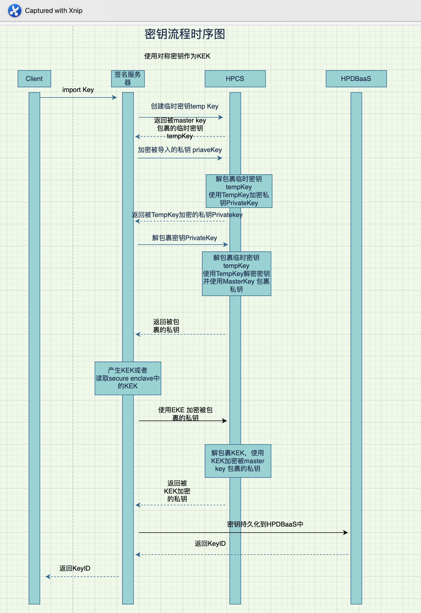

# Signing_server
 
 使用签名服务器用来展示Hyper Protect service 的使用场景

### 环境介绍

- 通过类似多方合约的方式部署签名服务器到可信执行环境HPVS
- Client 通过RestAPI与签名服务器通信
- 由于签名服务器是以黑盒子的方式部署到HPVS内的，这里log信息通过内网发送到logDNA
- 签名服务器通过GREP11 API 与HPCS 通信，生产环境还需要有MTLS 双向证书验证
- 经过加密的密钥，持久化到HPDBaaS内 
- IAM 对访问做认证以及权限控制


### Client 通过下列endpoint 与签名服务器通信

```sh

export SIGN_HOST=localhost
export SIGNING_PORT=8080

# 测试连通性
curl ${SIGN_HOST}:${SIGNING_PORT}/v1/grep11/get_mechanismsc

# 产生椭圆曲线Key pair
curl ${SIGN_HOST}:${SIGNING_PORT}/v1/grep11/key/generate_ec_keypair -X POST -s | jq

# 获取公钥
curl ${SIGN_HOST}:${SIGNING_PORT}/v1/grep11/key/public/${KEY_UUID} -s | jq

# 获取被包裹的私钥
curl ${SIGN_HOST}:${SIGNING_PORT}/v1/grep11/key/private/${KEY_UUID} -s | jq

# 使用私钥签名数据
curl ${SIGN_HOST}:${SIGNING_PORT}/v1/grep11/key/sign/${KEY_UUID}  -s -X POST -d '{"data":"the text need to encrypted to verify kay."}'

# 使用公钥验证签名
curl ${SIGN_HOST}:${SIGNING_PORT}/v1/grep11/key/verify/${KEY_UUID}  -s -X POST -d '{"data":"the text need to encrypted to verify kay.","signature":"guoQxLxqOYUbZ2O7jgbLnte4XA0SxSD0xj0/m6SVI0PaIBODQ/WJEZ+By2XqFzrRJyUUc8XFrXcLfHTjFmJjlA"}' |jq


# 使用master key包裹导入的AES，并持久化到HPDBaaS
curl ${SIGN_HOST}:${SIGNING_PORT}/v1/grep11/key/import_aes -X POST -s -d '{"key_content":"E5E9FA1BA31ECD1AE84F75CAAA474F3A"}' |jq

#使用导入的AES Key 加密数据与明文AES加密数据结果对比，如果一样就证明导入到key是正确的，并且被master key 包裹了
curl ${SIGN_HOST}:${SIGNING_PORT}/v1/grep11/key/verify_import_aes/${KEY_UUID}  -X POST -d '{"key_content":"E5E9FA1BA31ECD1AE84F75CAAA474F3A","data":"the text need to encrypted to verify kay."}'

####################### 导入外部密钥
# 产生ECDSA 私钥 PEM 格式的密钥，作为外部的密钥
openssl ecparam -genkey -name prime256v1 -noout -out ec256-key-pair.pem

# 提取公钥
openssl ec -in ec256-key-pair.pem -pubout > ec256-key-pub.pem

# 上传外部的私钥并持久化到HPDBaaS
curl ${SIGN_HOST}:${SIGNING_PORT}/v1/grep11/key/import_ec -X POST -s  -F "file=@./ec256-key-pair.pem" | jq

# 使用导入到私钥签名 
curl ${SIGN_HOST}:${SIGNING_PORT}/v1/grep11/key/sign/${KEY_UUID} -s -X POST -d '{"data":"the text need to encrypted to verify kay."}' | jq

# 使用公钥验证签名
curl ${SIGN_HOST}:${SIGNING_PORT}/v1/grep11/key/verify/${KEY_UUID} -s -X POST -d '{"data":"the text need to encrypted to verify kay.","signature":"UjVXX0/CcX4RzZmMW5lkcK5/N8oUSCKd5eFiHUDNgsby74skSD3cbJN4bTesinVq1b4QzbLSnDpuNkl89i8FSw"}'

#  签名ec 返回ANS1的签名
curl ${SIGN_HOST}:${SIGNING_PORT}/v1/grep11/key/sign/${KEY_UUID}  -s -X POST -d '{"data":"the text need to encrypted to verify kay.","sig_format":"ans1"}' | jq

# 使用本地公钥验证签名
# 通过HPCS 产生签名，并使用导入之前到公钥验证签名，签名验证正确，证明被导入到私钥是正确的，且被双层加密
echo -n "the text need to encrypted to verify kay." > test.data
echo -n "MEYCIQDd7kmZc0E/zPq7vDkQ/VmeM0OaVS1XnGsdi/e10xYUBwIhAOEcYNXoAYAeIcOkUlrDr4g8MjQVLZKa8q4aQQNps5IJ" |gbase64 --decode -w 0  > signature.sig
openssl pkeyutl -verify -in test.data -sigfile  signature.sig  -pubin  -inkey ec256-key-pub.pem


```
### GREP11 API 使用举例时序图与说明

  - 步骤说明


## 导入密钥流程

1.  GREP11 AP1 导入私钥时序图与说明


2. 步骤说明
   - 说明： 所有HPCS产生的私钥都通过内部的master key进行包裹后返回的，明文密钥的生命周期不能离开HPCS内部的HSM加密卡。在密钥使用前，HPCS会对被包裹的密钥在内部进行解包裹（解密），密钥使用后，明文密钥在HSM内部被丢弃，这些步骤都是发生在HPCS内部的，客户是无感知的，所以下面不对这部分内容做特别说明。

   - 大致流程如下：
   导入的密钥需要在导入之前对密钥进行加密，然后在HSM内部进行解密。在HSM 内部，master key对解密后的明文私钥进行包裹，HPCS返回被包裹的私钥给签名服务器，签名服务器用本地的KEK在HPCS内对被包裹的私钥进行二次加密，被KEK二次加密的私钥，持久化到HPDBaaS内。

   - 以上步骤对应的客户端请求为
     ```sh
      curl ${SIGN_HOST}:${SIGNING_PORT}/v1/grep11/key/import_ec -X POST -s  -F "file=@./ec256-key-pair.pem" | jq
     ```
   
   - 疑问1：HPCS 对私钥使用master key 包裹后，相当于密钥已经被master key加密了，为什么还需要用签名服务器内的KEK进行二次加密？
   这一步是可选的，设计这一步的目的是签名服务器的KEK是保存在HPVS内的secure enclave内的安全边界内的可信执行环境里的，所以这可以保证所有的操作必须由签名服务器来发起，因为只有签名服务器内有KEK


   - 疑问2： 如何保证签名服务器内对KEK的安全与可持久性？
    签名服务器本事运行在HPVS内的可信执行环境里（机密计算）并且通过多方合约的方式部署上去的。 签名服务器内的secure enclave 是可以做快照与跨区域备份的，而且是用多方部署的时候的产生的种子进行加密的，这意味着只有客户自己才能进场解密，因为种子的持有人是通过多方部署的形式由客户多个持有人控制的。
